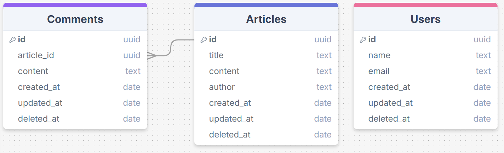

# Article Server

## Technologies Used:

- **TypeScript**
- **Node.js**
- **Mongo DB**
- **Docker**
- **Docker Compose**
- **Jest**

## Database:

## **End Points**

### **Users**

- **GET** `/users` - Retrieve all users.
- **GET** `/users/:id` - Retrieve a specific user by ID.
- **POST** `/users` - Create a new user.

---

### **Comments**

- **GET** `/comments` - Retrieve all comments.
- **GET** `/comments/:id` - Retrieve a specific comment by ID.
- **POST** `/comments` - Create a new comment.

---

### **Articles**

- **GET** `/articles` - Retrieve all articles.
- **GET** `/articles/:id` - Retrieve a specific article by ID.
- **GET** `/articles/find/:str` - Find a specific string within the body of articles.
- **POST** `/articles` - Create a new article.

## Getting Started:

### Assigment Checkers:

To run the application and validate assignments, use:

- `docker-compose up`
  This command will build and start the application in a Docker container using the default docker-compose.yml.

### Develop:

To start the application in development mode, use the following command:

- `docker-compose -f docker-compose.dev.yml up`
  This uses the docker-compose.dev.yml file, which is typically configured for hot-reloading and development optimizations.

  To run the test: Enter the development container and ren `npm run test`

## libraries:

- **dotenv**
- **express**
- **mongoose**
- **morgan**
- **Jest**
- **Supertest**
